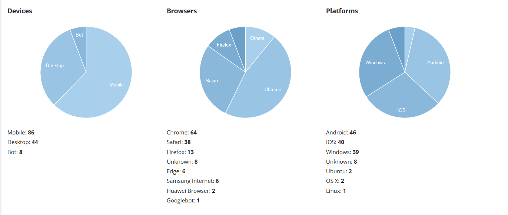

# Device Details

A plugin to display charts about devices, platforms and browsers.  
Requires Your Own URL Shortener ([YOURLS](https://yourls.org)) `v1.9.2` and above.

## Usage

## Installation
1. Install the required dependency, navigate to the root directory of your YOURLS installation and run the following command: `composer require whichbrowser/parser`
2. In `user/plugins` create a new folder named `device-charts`
3. Put this `plugin.php` script into the folder
5. In admin page activate plugin

## License
This package is licensed under the [MIT License](LICENSE.txt).

## Acknowledgments

- This plugin is inspired and based on https://github.com/SachinSAgrawal/YOURLS-Device-Details
- It leverages functions and components found in the `yourls-infos.php` script located in the `yourls` codebase.
